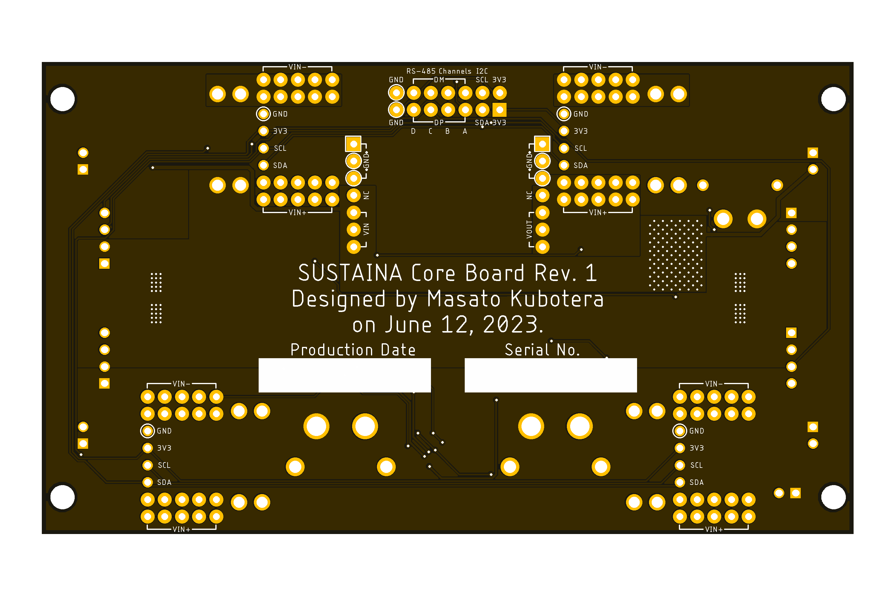

<html lang="en">

<head>
	<meta charset="uft-8">
	<meta name="author" content="Masato Kubotera">
    <meta name="description" content="">
</head>

<body>
	<h1>PCB Order</h1>
        

            PCB/PCBA ordering were outsourced to <a href="https://jlcpcb.com/">JLCPCB</a>. 
            The following files were used to generate files for PCB/PCBA orders.
            <ul>
                <li>Eagle Design File:
                    <a href="https://github.com/JLCPCB/jlcpcb-eagle/blob/master/design%20rules/jlcpcb-2layers.dru">jlcpcb-2layers.dru</a>
                </li>
                <li>Eagle CAM File:
                    <a href="https://github.com/JLCPCB/jlcpcb-eagle/blob/master/cam/jlcpcb_2_layer_v9.cam">jlcpcb_2_layer_v9.cam</a>
                </li>
                <li>BOM/CPL Exporter ULPs:
                    <a href="https://github.com/JLCPCB/jlcpcb-eagle/blob/master/ulps/jlcpcb_smta_exporter.ulp">jlcpcb_smta_exporter.ulp</a>
                </li>
            </ul>
            These are distributed in <a href="https://github.com/JLCPCB/jlcpcb-eagle">github.com/JLCPCB/jlcpcb-eagle</a>. 
        

    <h2>PCB Order Specifications</h2>
        
           
            <table>
                <tr>
                    <th>PCB Top Image</th>
                    <th>PCB Bottom Image</th>
                </tr>
                <tr>
                    <td></td>
                    <td></td>
                </tr>
            </table>
            The following  files used to order the PCB and their specifications. 
            <ul>
                <li>Gerber data: <a href="Gerber_date.zip">Gerber_date.zip</a></li>
            </ul>
            

                
Click for more specifications

                <ul>
                    <li>Base Material: FR-4</li>
                    <li>Layers: 2</li>
                    <li>Dimension: 120 mm * 70 mm</li>
                    <li>Product Type: Industrial/Consumer electronics</li>
                    <li>Different Design: 1</li>
                    <li>Delivery Format: Single PCB</li>
                    <li>PCB Thickness: 1.6</li>
                    <li>Impedance Control: no</li>
                    <li>PCB Color: Red</li>
                    <li>Silkscreen: White</li>
                    <li>Surface Finish: HASL(with lead)</li>
                    <li>Outer Copper Weight: 2 oz</li>
                    <li>Via Covering: Tented</li>
                    <li>Board Outline Tolerance: ±0.2mm(Regular)</li>
                    <li>Confirm Production file: No</li>
                    <li>Remove Order Number: Yes</li>
                    <li>Deburring/Edge rounding: No</li>
                    <li>Flying Probe Test: Fully Test</li>
                    <li>Gold Fingers: No</li>
                    <li>Castellated Holes: No</li>
                    <li>4-Wire Kelvin Test: No</li>
                    <li>Paper between PCBs: No</li>
                    <li>Appearance Quality: IPC Class 2 Standard</li>
                    <li>Silkscreen Technology: Ink-jet/Screen Printing</li>
                    <li>Package Box: With JLCPCB logo</li>
                </ul>
            

        

    <h2>PCB Stencil Order Specifications</h2>
        

                

                
Click for more specifications

                <ul>
                    <li>Framework: No</li>
                    <li>Step Stencil: No</li>
                    <li>Dimension: 380mm * 280mm</li>
                    <li>Customer size: 120mm * 70mm</li>
                    <li>Stencil Side: Top</li>
                    <li>Electropolishing: Sanding</li>
                    <li>Fiducials: No Fiducial</li>
                    <li>Confirm Production file: No</li>
                </ul>
            

        

    </body>
</html>
